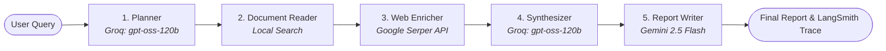

# 🔍 LangSmith Lab & Sequential Document Intelligence Agent

[](https://www.python.org/downloads/)
[](https://www.langchain.com/)
[](https://langchain-ai.github.io/langgraph/)
[](https://smith.langchain.com/)
[](https://streamlit.io/)

A production-grade laboratory and agentic application demonstrating end-to-end **LLM Observability**, **Multi-Model Orchestration**, and **Sequential Agent Workflows** using **LangGraph**, **LangSmith**, **Groq (OpenAI GPT-OSS 120B)**, **Google Gemini (2.5 Flash)**, and **Google Serper API**.

---

## 🌟 Architecture Overview

The system implements a multi-step, sequential document intelligence agent orchestrated by **LangGraph**. Every node execution, latency metric, token consumption, and intermediate state is automatically monitored and traced in real-time within **LangSmith**.



### Pipeline Flow

1. **Planner (`Groq`)**: Deconstructs and clarifies the user query into a targeted, searchable prompt.
2. **Document Reader**: Extracts pertinent paragraphs and domain knowledge from internal reference documentation.
3. **Web Enricher (`Google Serper`)**: Fetches up-to-date online intelligence to supplement internal knowledge.
4. **Synthesizer (`Groq`)**: Reconciles doc insights with live web search results into a unified markdown analysis with source citations.
5. **Report Writer (`Gemini 2.5 Flash`)**: Synthesizes the analysis into an executive, formatted technical report (TL;DR, bullet points, conclusion).

---

## 📁 Repository Structure

```text
├── agent/
│   ├── __init__.py
│   ├── graph.py             # LangGraph state machine & pipeline graph assembly
│   ├── nodes.py             # Agent node definitions (Planner, Reader, Enricher, etc.)
│   ├── state.py             # AgentState TypedDict schema
│   └── tools.py             # Knowledge-base search utilities
├── app.py                   # Streamlit web interface with interactive trace inspector
├── graph_entry.py           # LangGraph Studio / CLI deployment entry point
├── langgraph.json           # LangGraph configuration manifest
├── langsmith_book.ipynb     # Interactive playground & observability walkthrough
├── pyproject.toml           # Build configuration & dependencies
└── .env.example             # Template for API credentials & telemetry flags
```

---

## 🚀 Quick Start

### 1. Prerequisites & Environment Setup

Clone the repository and install dependencies using [`uv`](https://github.com/astral-sh/uv):

```bash
git clone https://github.com/MustafaKocamann/Langsmith-Lab.git
cd Langsmith-Lab

# Create virtual environment and install packages
uv sync
uv pip install -e .
```

### 2. Configure Environment Variables

Create your `.env` file based on `.env.example`:

```bash
cp .env.example .env
```

Populate the required credentials in `.env`:

```env
# LangSmith Observability
LANGSMITH_TRACING=true
LANGSMITH_ENDPOINT=https://api.smith.langchain.com
LANGSMITH_API_KEY="your-langsmith-api-key"
LANGSMITH_PROJECT="langsmith-lab"

# Model & Search Providers
GROQ_API_KEY="your-groq-api-key"
GEMINI_API_KEY="your-gemini-api-key"
SERPER_API_KEY="your-serper-api-key"
TAVILY_API_KEY="your-tavily-api-key" # Optional
```

---

## 🖥️ Running the Application

### Option A: Streamlit Interactive UI

Launch the web app for end-to-end chat, state inspection, and trace linking:

```bash
uv run streamlit run app.py
```

### Option B: LangGraph Studio (CLI)

Run or inspect the state machine using the LangGraph CLI:

```bash
uv run langgraph dev
```

### Option C: Jupyter Notebook Lab

Explore step-by-step telemetry, evaluation runs, and individual components:

```bash
uv run jupyter lab
# Open langsmith_book.ipynb
```

---

## 📊 Observability & LangSmith Highlights

- **Zero-Code Instrumentation**: Native tracing via standard LangChain environment flags (`LANGSMITH_TRACING=true`).
- **Granular Run Trees**: Track parent-child relationships across the complete sequential chain (`AgentState` transitions).
- **Multi-Vendor Cost & Latency Profiling**: Compare invocation latency and token consumption across Groq and Gemini.
- **Audit Trails**: Inspect intermediate steps via `steps_taken` metadata recorded inside each state iteration.

---

## 📜 License

This project is licensed under the MIT License - see the LICENSE file for details.
